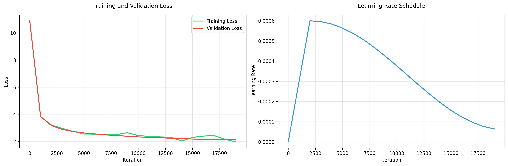

# DeepSeek-Children-Stories 

A state-of-the-art DeepSeek model optimized for children's story generation, featuring advanced architecture with just ~15-18M parameters.

## Architecture Highlights


- **Multihead Latent Attention (MLA)** - DeepSeek's efficient attention mechanism
- **Mixture of Experts (MoE)** - 4 experts with top-2 routing for increased capacity
- **Multi-token Prediction** - Predicts next 2 tokens simultaneously for efficiency
- **Rotary Positional Encodings (RoPE)** - Better position understanding

## Model Specifications

- **Parameters**: ~15-18M (6 layers, 8 heads, 512 embedding dim)
- **Context Window**: 1024 tokens
- **Vocabulary**: GPT-2 compatible (50,257 tokens)
- **Training Data**: 2,000+ children's stories from Hugging Face

## Hardware Used

Training was performed on the following hardware:

- **GPU**: NVIDIA RTX 4090 (24 GB VRAM)
- **RAM**: 41 GB
- **CPU**: 6 vCPU

## Quick Start

### Installation

```bash
# Clone the repository
git clone https://github.com/ideaweaver-ai/DeepSeek-Children-Stories-15M-model.git
cd DeepSeek-Children-Stories-15M-model

# Install dependencies
pip install -r requirements.txt

# Setup the environment
chmod +x setup.sh
./setup.sh
```

### Training

```bash
# Start training
python src/run_training.py

# With custom parameters
python src/run_training.py --batch-size 8 --max-iters 10000 --learning-rate 6e-4
```

### Generation

```bash
# Generate stories
python src/generate.py --prompt "Once upon a time, there was a brave little mouse"

# With custom parameters
python src/generate.py --prompt "A magical forest adventure" --max-tokens 200 --temperature 0.8
```

## 📖 Example Output

Here's an example of a story generated by the model:

**Prompt**: "Once upon a time"

**Generated Story**:
```
it was a bright, sunny day, and lily and her little brother max were playing in their backyard. they found a piece of paper with two sentence written on it. "let's make sense of some of these sentences," said max, pointing to the first sentence. "these people are playing on the grass," "but i don't know," replied lily. she thought for a moment. "maybe they only talk with the others or not, right?" she asked. max nodded. "yeah, and what about 'he', 'he', 'an', 'man', and 'man'?" lily explained, "it means they're playing with their dogs. but they don't say anything about someone talking." max asked, "but what about the others? we don't talk to each other!" lily thought for a moment before answering, "that's right! sometimes, people try to talk to each other. when we talk about something, we need to tell others
```

## Training Metrics

<p align="center">
  
</p>

## Configuration

The model can be configured through command-line arguments:

```bash
# Model configuration
--n-layer 6          # Number of transformer layers
--n-head 8           # Number of attention heads
--n-embd 512         # Embedding dimension
--block-size 1024    # Context window size

# Training configuration
--batch-size 12      # Batch size
--max-iters 20000    # Maximum training iterations
--learning-rate 6e-4 # Learning rate
--eval-interval 1000 # Evaluation interval

# Advanced features
--moe-experts 4      # Number of MoE experts
--multi-token 2      # Multi-token prediction
```

## 🤗 Model Available on Hugging Face

The trained model is now available on Hugging Face Hub! You can use it directly:

**Model**: [lakhera2023/deepseek-children-stories](https://huggingface.co/lakhera2023/deepseek-children-stories)

## Features

### Advanced Architecture
- **MLA**: Efficient attention with shared key-value heads
- **MoE**: Mixture of experts for increased model capacity
- **Multi-token Prediction**: Simultaneous prediction of multiple tokens
- **RoPE**: Rotary positional encodings for better position understanding

### Training Optimizations
- Mixed precision training with gradient scaling
- PyTorch 2.0 compilation for speed
- Automatic checkpointing and model saving
- MoE auxiliary loss for load balancing

### Story Generation
- Creative and engaging children's stories
- Moral lessons and educational content
- Age-appropriate language and themes
- Consistent character development

## Performance

The model achieves:
- Efficient training with ~2.24GB GPU memory usage
- Fast inference for real-time story generation
- High-quality output suitable for children
- Scalable architecture for different use cases


## Contributing

Contributions are welcome! Please feel free to submit a Pull Request.

## License

This project is licensed under the MIT License - see the LICENSE file for details.

## Acknowledgments

- DeepSeek team for the original architecture
- Hugging Face for the children's stories dataset
- PyTorch team for the excellent framework

## Links

- **GitHub**: https://github.com/ideaweaver-ai/DeepSeek-Children-Stories-15M-model

---

⭐ **Star this repository if you think Advanced Architecture + Tiny Models can do Big Things!** 
